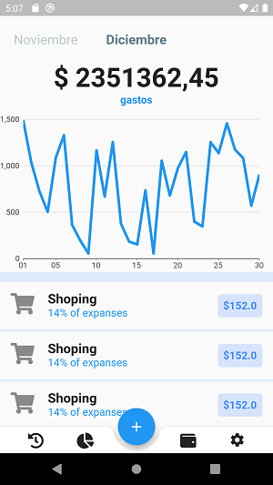

## version 00

# librerias

    font_awesome_flutter: ^8.8.1
    charts_flutter: ^0.9.0

## splasScreem

    dirigirse a la ruta
    <root>/android/app/src/main/res/drawable/launch_background
    'control' es un archivo png
    y colocar
    <item android:drawable="@android:color/black" />
    <item>
        <bitmap
            android:gravity="center"
            android:src="@mipmap/control" />
    </item>

    <root>/android/app/src/main/AndroidManifest.xml
    android:icon="@mipmap/control"

## Imagenes

    SplasScreen

    control gastos plantilla

## git comandos

    git init
    git status
    git add .
    git status
    git commit -m "primer commit"
    git remote add origin https://github.com/macc001/practica-flutter000-controlGasto.git
    git push -u origin master
    git checkout nombre_rama
    git merge nombre_rama
    git branch nombre_rama
    git branch -d nombre_rama
